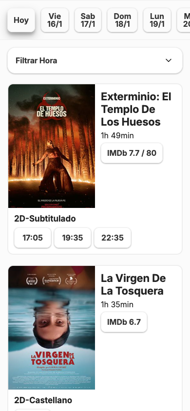

# Showtimes 🎬

Una PWA minimalista para ver los horarios de películas en **Cines Showcase** de Argentina.

## [➡️ Ver Cartelera](https://leonardoriviere.github.io/showtimes/)

<p align="center">
  
</p>

## Características

- 📅 **Vista por día** - Navega fácilmente entre fechas
- ⭐ **Ratings de IMDb y Metascore** - Ve las puntuaciones sin salir de la app
- 🕐 **Filtro de horarios** - Filtra funciones por rango de hora
- 📱 **PWA** - Agregala a tu pantalla de inicio como una app nativa
- 🔗 **Deep links a IMDb** - Abre la app de IMDb directamente en la película

## Stack

- **Frontend**: HTML, CSS, JavaScript vanilla
- **Scraping**: Python + Selenium
- **CI/CD**: GitHub Actions (actualización automática martes y miércoles)
- **Hosting**: GitHub Pages

## Desarrollo local

```bash
# Clonar el repo
git clone https://github.com/leonardoriviere/showtimes.git
cd showtimes

# Crear entorno virtual e instalar dependencias
python3 -m venv venv
source venv/bin/activate
pip install -r scraper/requirements.txt

# Ejecutar el scraper
python scraper/scraper.py

# Servir localmente
cd docs && python -m http.server 8000
```

## Licencia

MIT
